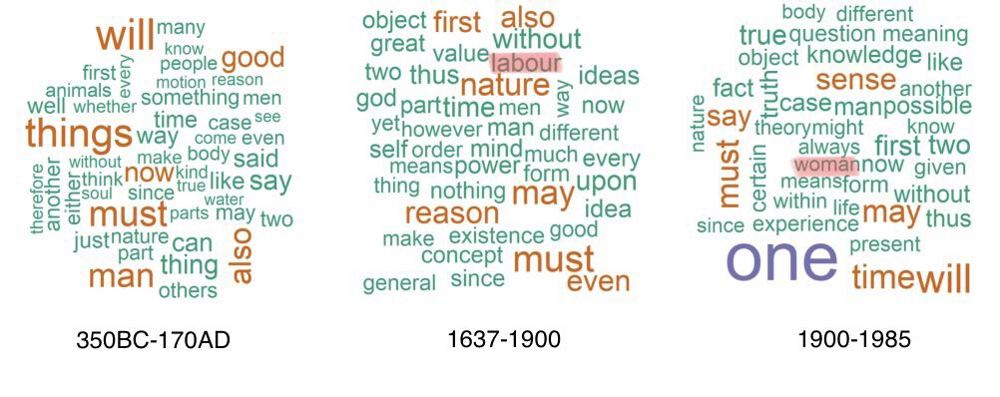
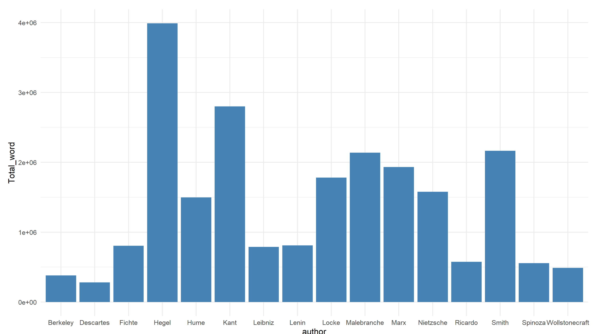
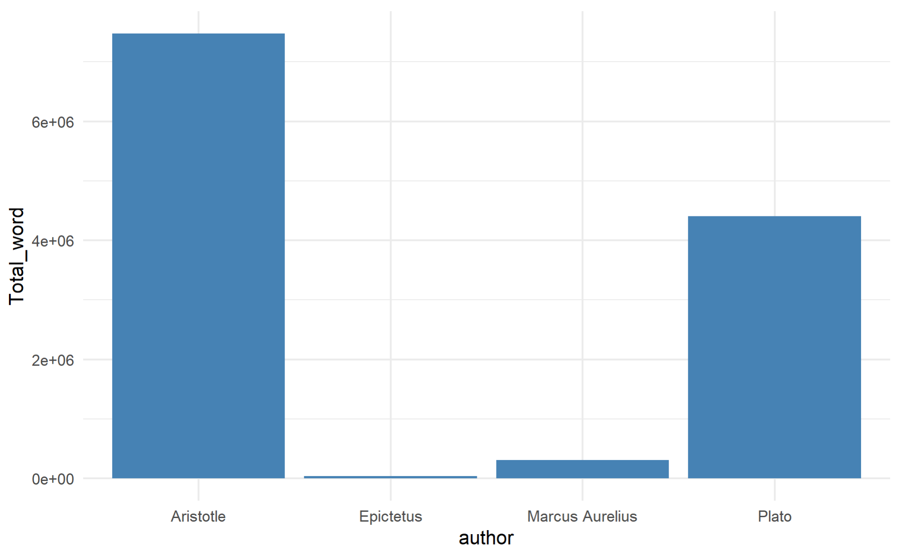

## TF Matching

### Question

Can you match the 3 sets of frequently used terms with their corresponding time period?

\

$$A. 350BC-170AD$$    $$B. 1637-1900$$           $$C. 1900-1985$$
\

\

\

\

### Answer

### Labour

"Labour" instead of "Labor", we know this is not American English and it may come from the time period even before 1776. I learned the word of labour in my economics class: labor force is one of the most important component of capital. And from the authors in the time period 1637-1900, there are some familiar ones like Marx. 

Karl Marx was both a German philosopher and a economist in the 19th century. We know Marxism is related to economic relations under capitalism and the material basis for class struggle. It would suggest that class rule of the bourgeoisie in capitalist society rests on the wage slavery of the workers. The theory of surplus value explained the poverty experienced by the working class. So it is very common for philosophers in that time period to use the word "labour".

### Woman

Although there's no capitalism nor scientific subject like economics, there must be women 2000 years ago. I wondered why philosophers did not mention "women" frequently at that time. I found that the majority of the words in the dataset are from Aristotle and Plato.

After some research I found that in Aristotle's Politics, he saw women as subject to men, but as higher than slaves, and lacking authority; he believed the husband should exert political rule over the wife. For example, in his work Politics (1254b13–14), Aristotle states "as regards the sexes, the male is by nature superior and the female inferior, the male ruler and the female subject". Although Plato was open to the potential equality of men and women, stating both that women were not equal to men in terms of strength and virtue, but were equal to men in terms of rational and occupational capacity, and hence in the ideal Republic should be educated and allowed to work alongside men without differentiation, Aristotle appears to have disagreed. To further check this disagreement between the teacher and the student, besides Term Frequency, I also applied Inverse Document Frequency, taking account the relative importance of a word to a document.

After applying Inverse Document Frequency, "man" is one of the most important word in Aristotle's text whereas it is not in Plato's text. This is consistent to our previous information

